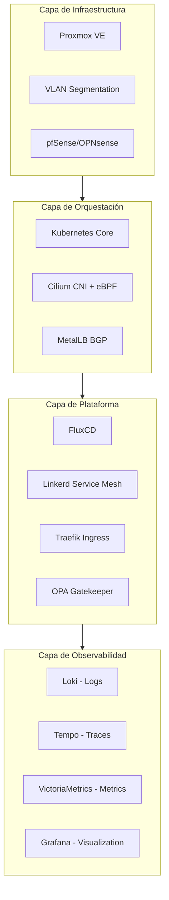

# KTSW: Kubernetes The Sweaty Way

## 1. Visión General del Proyecto

**KTSW** es una iniciativa de ingeniería diseñada bajo una premisa fundamental: **la competencia técnica se forja en la fricción.**

La mayoría de los tutoriales y herramientas modernas de DevOps (EKS, GKE, herramientas "magic-box") buscan abstraer la complejidad, ofreciendo caminos felices que ocultan el funcionamiento interno de los sistemas. Este proyecto hace lo contrario. El objetivo es construir un entorno de homelab tan técnicamente demandante y granular que la operación de infraestructuras empresariales de producción parezca trivial en comparación.

Si *Linux From Scratch* es la forja para entender el sistema operativo, **KTSW** es la forja para entender la orquestación de sistemas distribuidos a escala.

---

## 2. Filosofía de Arquitectura

### Complejidad Justificada vs. Accidental

Es crucial distinguir entre complejidad accidental (configuraciones malas) y complejidad esencial (necesaria para resolver problemas difíciles). KTSW implementa **complejidad esencial de nivel enterprise** en un entorno controlado.

!!! quote "El Principio de Sobrecarga Progresiva"
Implementamos tecnologías que resuelven problemas de escala masiva (Service Mesh, BGP, Distributed Tracing) aunque la escala de tráfico actual no lo requiera obligatoriamente, con el fin de dominar la solución técnica antes de que el problema operativo aparezca.

### Matriz de Decisiones Técnicas

=== "Enfoque Tradicional / Fácil"
* LoadBalancers gestionados por la nube (ALB/ELB).
* Seguridad perimetral básica (Security Groups).
* Observabilidad reactiva (logs cuando algo falla).
* Despliegues manuales o scripts imperativos.
* Networking plano y confiable por defecto.

=== "Enfoque KTSW / Enterprise"
*  Implementación de **BGP** y anuncio de rutas propias (MetalLB/FRR).
* **Zero Trust Networking** y mTLS estricto intra-cluster.
* Observabilidad continua basada en **eBPF** y trazas distribuidas.
* **GitOps estricto** con reconciliación automática.
* Network Policies de denegación por defecto (Default Deny).

---

## 3. Arquitectura del Sistema

El diseño sigue un modelo de capas estrictas de abstracción.

---

## 4. Stack Tecnológico Detallado

### Capa 1: Infraestructura y Virtualización

El control comienza en el "metal". Rechazamos instancias de nube pública para forzar el manejo de recursos físicos y redes L2/L3.

#### 1. Proxmox VE (Hypervisor)

* **Justificación:** Permite la gestión de recursos a nivel de kernel (KVM/LXC) y la simulación de topologías de red complejas mediante Open vSwitch.
* **Objetivo Técnico:** Comprender la diferencia entre aislamiento por virtualización completa y paravirtualización, así como la gestión de storage pools (ZFS).

#### 2. Segmentación de Red (VLANs 802.1Q)

La red no es plana. Separamos tráfico para simular un entorno de centro de datos real.

* **VLAN 10 (Mgmt):** Plano de control, SSH, Proxmox UI.
* **VLAN 20 (Nodes):** Tráfico de Kubelet, etcd y overlay network.
* **VLAN 30 (Storage):** Tráfico dedicado iSCSI/NFS/Longhorn para evitar latencia en apps.
* **VLAN 40 (Public):** VIPs expuestas por el LoadBalancer.

#### 3. pfSense/OPNsense (Edge Router)

* **Justificación:** Actúa como gateway perimetral, gestionando VPNs (WireGuard), DNS Resolver (Unbound) y reglas de firewall stateful entre VLANs.

---

### Capa 2: Kubernetes Networking (CNI & BGP)

Aquí reside gran parte de la complejidad intencional.

#### 4. Cilium (CNI & Security)

Utilizamos Cilium para reemplazar `kube-proxy`.

* **Tecnología:** **eBPF** (Extended Berkeley Packet Filter).
* **Justificación:** Elimina la dependencia de `iptables` para el enrutamiento de servicios, permitiendo un throughput mayor y latencia menor. Habilita **Hubble** para generar un mapa de dependencias de red en tiempo real.

#### 5. MetalLB (Load Balancing)

* **Modo:** **BGP** (Border Gateway Protocol).
* **Justificación:** En lugar de usar ARP (Capa 2), configuramos MetalLB para hablar BGP con el router pfSense. Esto permite entender protocolos de enrutamiento dinámico y ECMP (Equal-Cost Multi-Path) para alta disponibilidad real de IPs de entrada.

---

### Capa 3: Plataforma y GitOps

La regla de oro: **"Si no está en Git, no existe"**. El acceso por SSH a los nodos o el uso de `kubectl apply` manual está prohibido para operaciones normales.

#### 6. FluxCD (GitOps Controller)

* **Mecanismo:** Reconciliación continua.
* **Justificación:** El cluster "tira" (pull) de la configuración desde Git. Esto asegura recuperación ante desastres (DR) inmediata: si el cluster muere, se levanta uno nuevo, se instala Flux, y el estado se restaura solo.

#### 7. Tekton (CI Pipelines)

* **Diferenciador:** A diferencia de Jenkins o GitHub Actions, Tekton corre *dentro* del cluster como recursos nativos (CRDs).
* **Justificación:** Unifica el plano de control de la infraestructura y el del despliegue de software. Permite construir imágenes (con Kaniko) y desplegarlas sin salir del entorno de Kubernetes.

#### 8. Harbor (Container Registry)

* **Funcionalidad:** Almacenamiento de imágenes, escaneo de vulnerabilidades (Trivy) y firma de imágenes (Notary/Cosign).
* **Justificación:** Control total de la cadena de suministro de software (Software Supply Chain).

---

### Capa 4: Seguridad y Políticas

#### 9. OPA Gatekeeper (Policy Engine)

* **Concepto:** Policy as Code.
* **Implementación:** Reglas escritas en lenguaje **Rego** que interceptan las peticiones al API Server.
* **Casos de uso:** Prohibir contenedores corriendo como `root`, exigir límites de recursos (CPU/RAM) y validar procedencia de imágenes.

#### 10. Gestión de Secretos (SOPS + Age)

* **Justificación:** Permite almacenar secretos en repositorios públicos o privados de forma segura. Los secretos se desencriptan únicamente dentro del cluster por el controlador de Flux.

---

### Capa 5: Observabilidad (Stack LGTM)

No es suficiente saber que algo falló; es necesario saber *por qué*, *dónde* y *cuándo* con precisión de milisegundos.

#### 11. VictoriaMetrics (Métricas)

* **Selección:** Elegido sobre Prometheus por su eficiencia en almacenamiento y capacidad para manejar alta cardinalidad ("High Cardinality").

#### 12. Loki (Logs)

* **Filosofía:** "Like Prometheus, but for logs". No indexa el texto completo, solo metadatos, permitiendo correlación directa entre picos de métricas y líneas de logs mediante LogQL.

#### 13. Tempo (Trazas Distribuidas)

* **Estándar:** OpenTelemetry.
* **Justificación:** Permite visualizar la latencia en cada salto de una petición HTTP a través de múltiples microservicios (Ingress -> Frontend -> API -> DB).

---

### Capa 6: Datos y Persistencia

El estado es la parte difícil de Kubernetes. KTSW aborda esto frontalmente.

#### 14. Longhorn (Block Storage)

* **Arquitectura:** Storage distribuido nativo de nube. Convierte el almacenamiento local de los nodos en un pool replicado y resiliente.

#### 15. CloudNativePG (PostgreSQL)

* **Operador:** Gestiona el ciclo de vida de la base de datos: failover automático, backups a S3 (MinIO) y Point-in-Time Recovery (PITR).

#### 16. NATS JetStream (Messaging)

* **Uso:** Bus de mensajes para comunicación asíncrona entre microservicios, reemplazando REST para operaciones internas de alto rendimiento.

---

## 5. Aplicación de Referencia: "Distributed Task Processor"

Para validar la infraestructura, se desarrollará una aplicación que ejercite todos los componentes.

**Componentes de la App:**

1. **API Gateway (Go):** Recibe requests, valida JWT (Keycloak), deposita trabajos en NATS.
2. **Worker Pool (Rust/Go):** Escucha NATS, escala horizontalmente (HPA) basado en la profundidad de la cola, procesa datos y guarda en Postgres.
3. **Status Service (Node):** Lee de Redis (Caché) y Postgres para dar feedback al usuario vía WebSockets.

---

## 6. Roadmap de Implementación

### Fase 0: Fundamentos (La Base Física)

* Configuración de Proxmox y Networking físico.
* Definición de VLANs y reglas de Firewall en pfSense.
* Bootstrap de cluster Kubernetes (k3s hard mode).

### Fase 1: Conectividad y Seguridad (La Red)

* Despliegue de **Cilium** y eliminación de kube-proxy.
* Configuración de **MetalLB** en modo BGP.
* Implementación de Ingress Controller (Traefik) y Cert-Manager.

### Fase 2: Control y GitOps (El Cerebro)

* Estructuración del repositorio de GitOps.
* Bootstrap de **FluxCD**.
* Configuración de encriptación de secretos (SOPS).
* Definición de políticas de admisión (Gatekeeper).

### Fase 3: Observabilidad (Los Ojos)

* Despliegue del stack LGTM (Loki, Grafana, Tempo, VictoriaMetrics).
* Instrumentación básica de componentes del sistema.
* Creación de Dashboards "Golden Signals".

### Fase 4: Datos y Plataforma (El Músculo)

* Estabilización de almacenamiento persistente (Longhorn).
* Despliegue de servicios de datos (Postgres, Redis, NATS).
* Configuración de Registry privado (Harbor).

### Fase 5: Aplicación y Pipelines (La Carga)

* Creación de pipelines de CI en **Tekton**.
* Desarrollo y despliegue de la aplicación "Distributed Task Processor".
* Implementación de HPA (Horizontal Pod Autoscaling) basado en métricas custom.

### Fase 6: Operaciones Día 2 y Caos (La Prueba de Fuego)

* **Backup & DR:** Implementación de Velero y pruebas de restauración total.
* **Chaos Engineering:** Instalación de **Litmus Chaos**.
* *Experimento 1:* Eliminar pod de base de datos master (validar failover).
* *Experimento 2:* Introducir latencia de red (validar timeouts y circuit breakers).
* *Experimento 3:* Pérdida completa de un nodo worker (validar reprogramación de pods).
